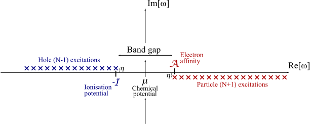
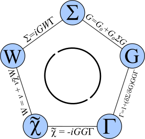
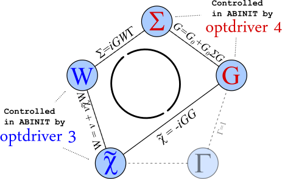
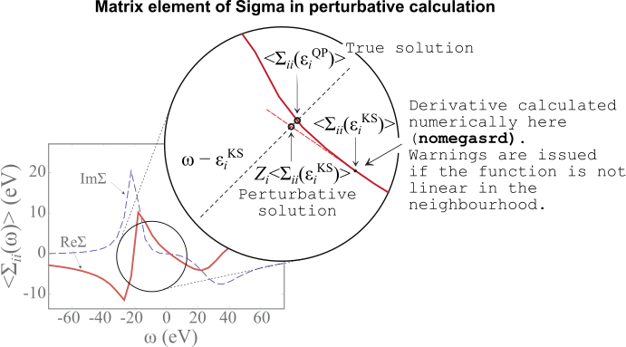
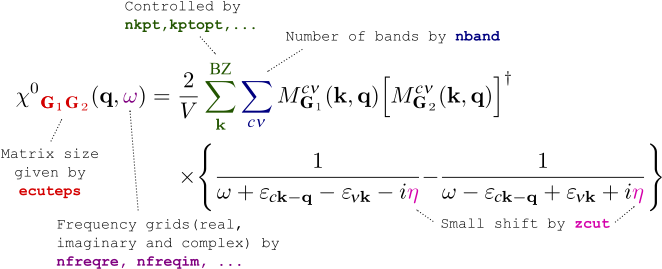
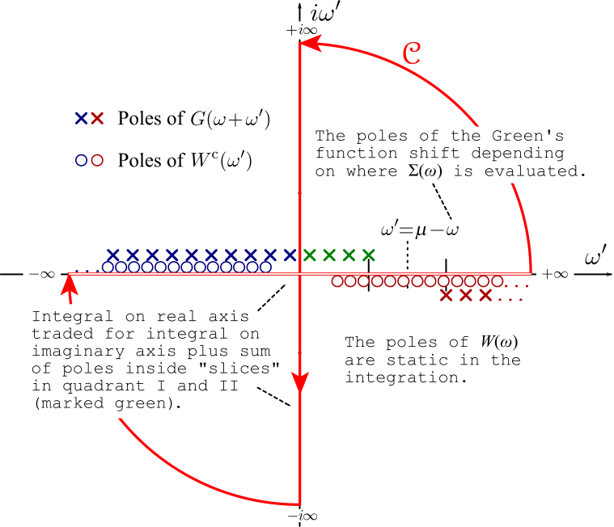

# Many-Body Theory in ABINIT  

The aim of this section is to introduce the Green's function formalism, the
concept of self-energy and the set of coupled equations proposed by Hedin
whose self-consistent solution, in principle, gives the exact Green's function
of the interacting system. We mainly focus on the aspects of the theory that
are important for understanding the different steps of the calculation and the
role played by the input variables used to control the run. A much more
consistent and rigorous introduction to the physical concept of Green's
function and self-energy can be found in any standard textbook on Many-Body
theory, see for example [[Abrikosov1975]], [[Fetter1971]], [[Mattuck1976]].

## 1 Green's function and self-energy
  
The time-ordered Green's function $G(12)$, also called the propagator, defines
the probability amplitude for the propagation of an added or removed electron
in a many-body system. Since the probability amplitude is simply given by the
overlap between the final and the initial state, $G(12)$ can be expressed as

\begin{equation} 
G(1,2) = -i\left\langle \Theta_0^N \left| \hat{T} \left[
\hat{\psi}(1)\hat{\psi}^{\dagger}(2) \right] \right| \Theta_0^N \right\rangle,
\end{equation} 

where the matrix element is taken in the Heisenberg representation, $\hat{T}$ is the time-ordering 
operator and the creation and annihilation field operators act on the ground state of the $N$-electron many-
body Hamiltonian (the conventions used in the equations are explained in the section on [[#notations]]). 
The propagator contains only part of the full
information carried by the many-body wave function, but it includes the
relevant part for the study of charged excitations. Also, any single-particle
operator acting on the system can be evaluated once the Green's function is known.

Useful physical information about the charged excitation energies of the many-
body system can be obtained by expressing the propagator in the so-called
Lehmann representation. [[Abrikosov1975]], [[Fetter1971]], [[Mattuck1976]]. 
To this purpose it is useful to introduce the following notation to denote the
charged excitation energies of the $N$-electron system [[Onida2002]]:

\begin{equation} 
\varepsilon_i = 
\begin{cases} 
E_i^{(N+1)} - E_0^N & \text{if}\,\varepsilon_i > \mu \\\ E_0^N-E_i^{(N-1)} & \text{if}\,\varepsilon_i < \mu, 
\end{cases} 
\end{equation} 

where _E 0N_ is the ground state energy of
the electron system with _N_ electrons, and _i_ is the set of quantum numbers
labeling the excited states with _N ±_1 electrons. Finally, _μ_ is the
chemical potential of the system. Other important quantities that will be used
in the following are the so-called Lehmann amplitudes defined, in the Schrodinger representation, by 

\begin{equation} \label{eq:Lehmann_amplitudes}
\Psi_i (\rr) \equiv \begin{cases} \langle\Theta_0^N|\hat\psi(\rr)
|\Theta_i^{N+1}\rangle \quad\qquad \ee_i > \mu \\\ \\\ \langle\Theta_i^{N-1}|
\hat\psi(\rr) |\Theta_0^N\rangle \quad\qquad \ee_i < \mu \end{cases}
\end{equation} 

The Lehmann representation of the Green's function

\begin{equation} \label{eq:Lehmann_representation} 
G (\rr_1,\rr_2;\ww) = \sum_i \frac{\Psi_i(\rr_1)\Psi_i^\*(\rr_2)} {\ww-\ee_i
+i\eta\,\sign(\ee_i-\mu)} \qquad\eta \rightarrow 0^+, 
\end{equation} 

makes it clear that, in the frequency domain, the time-ordered Green's function
contains the complete excitation spectrum corresponding to excitations of an (
_N_ -1)-particle and an ( _N_ +1)-particle system. Hence, locating the poles
of the Green's function in the complex plane provides the information needed
to interpret those processes measured in experiments in which a single
electron is inserted to or removed from the system. The figure below gives a
schematic representation of the location of the poles of the time-ordered Green's function.

Where the ionisation potential is the energy required to remove an electron
from the system, the electron affinity to add an electron, and the chemical
potential is typically taken to be in the middle of the gap. For a metallic
system these energies are all equal to each other, and there is no gap.

The Dyson equation

\begin{equation} \label{eq:G_eq_G0SG} 
G(12) = \Go(12) + \int \Go(13)\,\Sigma(34)\,G(42)\dd34. 
\end{equation} 

establishes a connection between the fully interacting _G_ and the propagator, _G 0_, of an approximate
non-interacting system through a (non-local, non-Hermitian and time dependent)
potential called the self-energy, Σ. Since _G 0_ is supposed to be known
exactly, the problem of calculating _G_ (12) has now been reduced to the calculation of the self-energy.

The self-energy is not a mere mathematical device used in a roundabout way to
obtain _G_ but is has a direct physical meaning. The knowledge of the self-
energy operator, allows one to describe the quantum-mechanical state of a
renormalized electron in the many-body system by solving the quasiparticle
(QP) equation [[Onida2002]]:

\begin{equation} \label{eq:QP_equation} 
\Bigl[ {\hat h}_0(\rr_1) + v_H(\rr_1)
\Bigr] \Psi(\rr_1) + \int\,\Sigma(\rr_1,\rr_2;\ee^\QP)\Psi(\rr_2)\dd\rr_2 = \ee^\QP \Psi(\rr_1) 
\end{equation}  

The QP eigenstates so obtained can be used
to construct _G_ according to the Lehmann representation. Note that the QP
equation departs from the Kohn Sham equation since the QP eigenvectors and
eigenvalues do have a direct physical meaning: they can be used to obtain both
the charge density of the interacting system and to describe the properties of charged excitations.

## 2 Hedin's equations
  
In 1965 Hedin [[Hedin1965]] showed how to derive a set of coupled integro-
differential equations whose self-consistent solution, in principle, gives the
exact self-energy of the system and therefore the exact _G_.

The fundamental building blocks employed in the formalism are the irreducible polarizability:

\begin{equation}\label{eq:chi_tilde_def} 
\tchi(12) \equiv \dfrac{\delta n (1)}{\delta \Ueff (2)} = -i\frac{\delta G(11^+)}{\delta \Ueff(2)}, 
\end{equation}

which describes the linear response of the density to changes in the total
effective potential (the superposition of the external potential plus the
internal classical Hartree potential) and the dynamically screened
interaction, _W_ , that is related to the bare Coulomb interaction, _v_ , and
to the inverse dielectric function through: 

\begin{equation} \label{W_def}
W(12) \equiv \int \ee^{-1}(13)\,v(32)\dd3. 
\end{equation} 

The dielectric matrix є(12) is related to the irreducible polarizability _χ_ (12) by the
following relation: 

\begin{equation} 
\ee(1, 2) = \delta(1, 2) - \int v(1, 3)\tchi(3, 2)\dd 3 
\end{equation}

The pentagon sketched in the figure below shows how the various physical quantities are interrelated:

The polarization function renormalises the bare interaction resulting in the
screened interaction _W_ (12). The screened interaction, _W_ (12), the many-
body propagator _G_ (12), and the vertex function, Γ(12;3), which describe the
interactions between virtual hole and electron excitations [[Onida2002]], are
the essential ingredients for the determination of Σ(12).

The iteration starts by setting _G_ = _G 0_. Then the set of equations should
in principle be iterated until self-consistency in all terms is reached.

## 3 The GW approximation
  
The practical solution of Hedin's equations is extremely complicated as they
are not just numerical relations but contain a functional derivative in the
equation for the vertex. The direct evaluation of the vertex function is very
challenging. The set of equations can, however, be iterated assuming that only
a few iterations are actually needed to obtain physically meaningful results.

A widely used approach to the approximate solution of Hedin's equations is the
so-called _GW_ approximation [[Hedin1965]], which consists in approximating
the vertex function with a local and instantaneous function:

\begin{equation} 
\Gamma(12;3) \approx \delta(1,2)\delta(1,3) \equiv \Gamma^{GW}(12;3). 
\end{equation} 

This approximated vertex, once inserted in
the full set of Hedin's equations, leads to a considerable simplification in the set of equations:

Thanks to the neglect of vertex corrections, the irreducible polarizability _χ_ (12) is now given by

\begin{equation}\label{eq:RPA_with_G} 
\tchi = -i\,G(12)G(21^+). 
\end{equation}

which, once rewritten in terms of orbitals and energies, reduces to the RPA
expression proposed by Adler [[Adler1962]] and Wiser [[Wiser1963]].

In real space, the self-energy reduces to a simple direct product of the
dressed electron propagator, _G_ (12), and the dynamically screened interaction, _W_ (12):

\begin{equation} 
\Sigma(12) = i G(12)\,W(1^+2). 
\end{equation}

The self-energy, a simple product in the space-time domain, becomes a convolution when
expressed in frequency-space: 

\begin{equation} 
\Sigma(\rr_1,\rr_2;\ww) = \frac{i}{2\pi} \int G(\rr_1,\rr_2;\ww+\ww') W(\rr_1,\rr_2;\ww')e^{i\ww'\delta^+}\dd\ww'. 
\end{equation}

Ideally, the set of GW equations should still be iterated until self-
consistency in all terms is reached; this is the fully self-consistent GW method (SCGW).  
However SCGW calculations for real systems are still very
challenging, and very few have been reported in the literature  Moreover, the
utility of fully SCGW results are still under debate within the scientific community.

The problem is that self-consistency typically improves total energies, but
worsens spectral properties (such as band gaps and optical spectra). Since
obtaining the spectral information is often the main reason for doing such
difficult calculations in the first place, many authors agree that a useful
self-consistent approach would need the inclusion of some kind of vertex
correction during the solution of the equations.

For this reason, the most common approach employed in the _ab initio_
community consists of using the best available approximation for _G_ and _W_
as a starting point and performing only a single-iteration of the
parallelogram (the so-called one-shot _GW_ method, or _G 0W0_). In this case
the self-energy is simply given by:

\begin{equation} 
\Sigma(12) = i\Go^\KS(12)\Wo(1^+2) 
\end{equation} 

where _G0KS_(12) is the independent-particle propagator of the Kohn-Sham (KS)
Hamiltonian, and the screened interaction is approximated with the RPA
calculated with KS energies and wave functions: 

\begin{equation} 
\chi^0(12) = -i \Go^\KS(12)\Go^\KS(12). 
\end{equation}

## 4 Perturbative approach
  
Despite all the fundamental differences between many-body theory and DFT, the
Kohn-Sham exchange-correlation potential can be seen as a static, local and
Hermitian approximation to the self-energy. Indeed, in many cases the Kohn-
Sham energies already provide a reasonable estimate of the band structure and
are usually in qualitative agreement with experiment.

This observation suggests that a simple, albeit accurate, solution for the QP
energies can be obtained using first-order perturbation theory, treating the
exchange and correlation potential, _V xc_, as a zeroth-order approximation to
the non-local and energy dependent self-energy [[Hybertsen1985]], [[Hybertsen1986]]

Under the assumption that the QP wavefunctions equal the KS orbitals, we can
expand the self-energy operator around _ε KS_ obtaining a closed expression for _ε QP_ :

\begin{equation} \label{eq:implicit_QP_energy} 
\ee^\QP = \ee^\KS + Z \langle\Psi^\KS|\Sigma(\ee^\KS)-\vxc|\Psi^\KS\rangle. 
\end{equation} 

where

\begin{equation} \label{eq:Z_factor} Z \equiv \left[ 1- \langle \Psi^\KS|
\PDER{\Sigma(\ee)}{\ee^\KS}|\Psi^\KS\rangle \right]^{-1} 
\end{equation} 

is the so-called renormalization factor. 
This corresponds to making a Taylor
expansion of the self-energy matrix element around the KS energy, as depicted below.

## 5 The RPA polarizability in Fourier space
  
In the reciprocal space and frequency domain (implying a Fourier transform
(FT) of the real space coordinates and time variables), the independent-
particle polarizability assumes the form:

where only the transitions between valence ( _v_ ) and conduction states (_c_) contribute 
(for simplicity we have assumed a semiconductor with time-
reversal invariance, the conventions used for the Fourier transform are
discussed in the [[#notations|notation]] section).

The number of bands used to compute the polarizability is specified by
[[nband]], while [[zcut]] gives the small complex shift used to avoid the
divergences in the denominators. The frequency mesh is defined by the set of
variables [[nfreqre]], [[nfreqim]], [[freqremax]], and [[freqremin]] (a number
of more exotic grid choices are available through input variables beginning
with gw_... or cd_..., e.g. [[gw_frqim_inzgrid]]).

_M_ is a shorthand notation to denote the matrix element of a plane wave
sandwiched between two wavefunctions (i.e. oscillator matrix elements). 
The number of planewaves (PW) used to describe the wavefunctions is determined by
[[ecutwfn]] while the number of _G_ -vectors used to describe the
polarizability (i.e. the number of _G_ vectors in the oscillator matrix
elements) is determined by [[ecuteps]]. 
The oscillators are ubiquitous in the Many-Body part of ABINIT and their calculation 
represents one of the most CPU intensive part of the execution. For this reason we 
devote [[#6|section 6]] to the discussion of some important technical details concerning their computation.

In principle, the set of **q** -points in the screening matrix is given by all
the possible differences between two crystalline momenta of the wavefunctions
stored in the KSS file, so it is controlled by the chosen **k** -point grid.
The code, however, exploits the invariance of the two-point function under the
action of any symmetry operation of the crystalline space group:

\begin{equation} 
\chi^0(\rr_1,\rr_2) = \chi^0
\bigl(\Ri(\rr_1-\tt),\Ri(\rr_2-\tt)\bigr) 
\end{equation} 

so that only the **q** -points in the irreducible Brillouin zone (IBZ) have to be calculated explicitly.

In frequency and reciprocal space, the microscopic dielectric function is
related to the irreducible polarizability by the following relation

\begin{equation} 
\ee_{\GG_1\GG_2}(\qq;\ww) = \delta_{\GG_1,\GG_2} - v(\qq,
\GG_1) \tchi_{\GG_1\GG_2}(\qq;\ww) 
\end{equation} 

from which the inverse dielectric function is obtained via matrix inversion. Following Adler
[[Adler1962]], the macroscopic dielectric function, єMLF(ω), can be directly
related to the inverse of the microscopic dielectric matrix by means of:

\begin{equation} \label{eq:abs_LFE} 
\ee_M^{\text{LF}}(\ww) = \lim_{\qq \rightarrow 0} \dfrac{1}{\ee^{-1}_{0 0}(\qq,\ww)} 
\end{equation} 

The optical absorption spectrum -- the quantity one can compare with experiments -- is
given by the imaginary part: Im[єMLF(ω)].

Note that the equation above differs from

\begin{equation} \label{eq:abs_NLFE} 
\ee_M^{\text{NLF}}(\ww) = \lim_{\qq \rightarrow 0} {\ee_{0 0}(\qq,\ww)} 
\end{equation} 

due to the so called local-field effects introduced by the presence of the crystalline environment. 
These spectra, if calculated, are typically output as ... **_LF** and ... **_NLF**
files during the course of a calculation.

## 6 Notes on the calculation of the oscillator matrix elements
  
Many body calculations require the evaluation of integrals involving the
oscillator matrix elements

where the **k** -point belongs to the full Brillouin zone.

These terms are evaluated by performing a Fast Fourier Transform (FFT) of the
real space product of the two wavefunctions (the second expression in the
equation above). Thanks to the FFT algorithm, the CPU-time requirement scales
almost linearly with the number of points in the FFT box, moreover the code
implements refined algorithms (for instance zero-padded FFTs, FFTW3 interface)
to optimize the computation.

There can be a significant speed-up in this component depending on the
numerical FFT library used. If possible, it should always be advantageous to
link and use the FFTW3 library in GW calculations (controlled by setting
[[fftalg]] 312). The performance of the various FFT libraries for a given type
of calculation can be benchmarked with the **fftprof** utility.

For a given set of indices ( _b 1_, _b 2_, **k** , **q** ), the calculation of
the oscillator is done in four different steps:

  1. The two wavefunctions in the irreducible wedge are FFT transformed from the **G** -space to the real space representation, 
  2. The orbitals are rotated in real space on the FFT mesh to obtain the points **k** and **k-q** in the full Brillouin zone. 
  3. Computation of the wavefunction product. 
  4. FFT transform of the product to obtain _M_

Each oscillator thus requires three different FFTs (two transforms to
construct the product, one FFT to get M). The number of FFTs can be
significantly reduced by pre-computing and storing in memory the real space
representation of the orbitals at the price of a reasonable increase of the
memory allocated. However, for very memory demanding calculations, the real
space orbitals can be calculated on the fly with an increase in computational
time instead. This option is controlled by the second digit of the input variable [[gwmem]].

The third term in the equation defining the oscillators makes it clear that
the product of the periodic part of the orbitals has non-zero Fourier
components in a sphere whose radius is 2 × _R wfn_ where _R wfn_ is the radius
of the **G** -sphere used for the wavefunctions (set by [[ecutwfn]]). To avoid
aliasing errors in the FFT one should therefore use an FFT box that encloses
the sphere with radius 2× _R wfn_, but this leads to a significant increase in
the computing effort as well as in the memory requirements. The input variable
[[fftgw]] specifies how to setup the FFT box for the oscillators and should be
used to test how the aliasing errors affect the final results. The default
setting of **fftgw 21** is safe, a setting of **fftgw 11** is fast but can be
inaccurate, and a setting of **fftgw 31** gives the maximum possible accuracy
at a significant computational cost.

## 7 Hilbert transform method
  
The computational effort for the evaluation of the RPA polarizability with the
Adler-Wiser expression scales linearly with the number of frequencies computed
([[nfreqre]] and [[nfreqim]]), albeit with a large prefactor which increases
with the fourth power of the number of atoms. The main reason for the linear
scaling is that the frequency dependence cannot be factorised out of the sum
over transitions, hence a distinct and expensive summation over transitions
has to be performed separately for each frequency.

This linear scaling represents a serious problem, especially when many
frequencies are wanted, for example when computing QP corrections within the
contour deformation technique described in the [[lesson_gw2|second lesson]] of the GW tutorial.

This computational bottleneck can be removed, under certain circumstances, by
employing an efficient algorithm proposed in [[Miyake2000]] and subsequently
revisited in [[Shishkin2006]], in which only the spectral function

has to be evaluated in terms of electronic transitions between valence and
conduction states. The Dirac delta function can be approximated either by
means of a triangular function centered at the energy transition following
[[Shishkin2006]] or a gaussian approximant following [[Miyake2000]] (see the
related input variables [[spmeth]], and [[spbroad]]). The spectral function is
evaluated on a linear frequency mesh which covers the entire set of transition
energies included in the calculation. The number of points in the mesh is given by [[nomegasf]].

The evaluation of the spectral function is rather efficient thanks to the
presence of the delta-function in the expression above. For example, when
[[spmeth]]=1, the CPU time required to compute the spectral function on an
arbitrarily dense frequency mesh is just twice that required by a single
static computation based on the standard Adler-Wiser expression.

The full polarizability is then efficiently retrieved by means of a less
expensive frequency integration (a Hilbert transform):

\begin{equation} \label{eq:chi0_Hilbert_transform} 
{\chi^0}_{\GG_1\GG_2}
(\qq,\ww) = \int_0^{+\infty} \tchi^\mcS_{\GG_1\GG_2} (\qq,\ww') \times
\biggl(\frac{1}{\ww-\ww'+i\delta}-\frac{1}{\ww+\ww'-i\delta}\biggr)\dd\ww'
\end{equation}

The price to be paid, however, is that a large table for the spectral function
has to be stored in memory and a Hilbert transform has to be performed for
each pair ( **G** 1, **G** 2). Since the computing time required for the
transform scales quadratically with the number of vectors in the
polarizability (governed by [[ecuteps]]), the CPU time spent in this part will
overcome the computing time of the standard Adler-Wiser formalism for large
[[ecuteps]]. A theoretical estimate of the crossover point is hard to give
because it depends on many factors. However, if many frequencies are needed,
such as for the evaluation of optical spectra, or accurate contour deformation
integrations, or even mapping full grids in the complex plane, the Hilbert
transform method can be significantly faster, and its use is well worth considering.

## 8 Evaluation of the GW self-energy
  
Following the standard approach, we separate the screened interaction into the
static bare Coulomb term and a frequency-dependent contribution according to:

\begin{equation} 
W = v + (\ee^{-1} - 1) v 
\end{equation} 

where matrix notation is used.

This particular decomposition of _W_ , once inserted in the convolution
defining Σ, leads to the split of the self-energy into two different
contributions (exchange and correlation):

\begin{equation} 
\Sigma(\rr_1,\rr_2;\ww) \equiv \Sigma_x(\rr_1,\rr_2) + \Sigma_c(\rr_1,\rr_2;\ww), 
\end{equation}

The exchange part is static and turns out to have the same mathematical
structure as the Fock operator in Hartree-Fock theory, albeit constructed with
quasiparticle amplitudes

\begin{equation}\label{eq:Sigma_x} 
\Sigma_x(\rr_1,\rr_2)= -\sum_\kk^\BZ
\sum_\nu^\text{occ} \Psi_{n\kk}(\rr_1){\Psi^\*_{n\kk}}(\rr_2)\,v(\rr_1,\rr_2)
\end{equation} 

while the dynamic part Σc(ω) accounts for correlation effects beyond Σx.

It is important to stress that, for computational efficiency, the code does
not compute the full self-energy operator by default. Only its matrix elements
for the states specified by [[kptgw]] and [[bdgw]] are computed and used to
obtain the QP corrections.

When expressed in reciprocal space, the diagonal matrix elements of the
exchange part are given by:

The evaluation of these terms represents a minor fraction of the overall CPU
time since only occupied states are involved. However we should always keep in
mind that, due to the long range of the bare Coulomb interaction, the
convergence with respect to the number of plane waves used in the oscillators
_M_ ([[ecutsigx]]) is usually slow, much slower than the convergence of the
correlation part, which is short-ranged. This plane wave cutoff can be
converged independently of others if necessary, and given a much larger value
in comparison to [[ecut]], [[ecutwfn]] and [[ecuteps]].

Another point worth noting is the presence in the expression of the Coulomb
singularity for | **q** + **G** | -> 0\. From a mathematical point of view,
the integral is well-defined since the singularity is integrable in three-
dimensional space once the thermodynamical limit, _N_ **q** -> ∞, is reached.
On the other hand, only a finite number of **q** -points can be used for
practical applications, and a careful numerical treatment is needed to avoid
an exceedingly slow convergence with respect to the BZ sampling. To accelerate
the convergence in the number of **q** -points, the code implements several
techniques proposed in the literature. We refer to the documentation of
[[icutcoul]] for a more extensive discussion.

The expression for the matrix elements of the correlation part is instead given by:

where all dynamical effects are now contained in the frequency convolution integral _J_.

The explicit expression for _J_ depends on the method used to treat the
screened interaction. The code implements four different plasmon-pole
techniques to model the frequency dependence of **W** in an efficient but
approximate way, alternatively, it is possible to use the more sophisticated
frequency integration of the contour deformation method [[Lebegue2003] for
accurate QP calculations (see the related variables [[ppmodel]] and [[gwcalctyp]]).

The double sum over **G** -vectors is performed for all the plane waves
contained within a sphere of energy [[ecuteps]] (it cannot be larger than the
value used to generate the SCR file). For each state, the correlated matrix
elements are evaluated on a linear frequency mesh centered around the initial
KS energy and the derivative needed for the renormalization factor is obtained
numerically (see [[nomegasrd]] and [[omegasrdmax]]).

Note that here, in contrast to the exchange term, the sum over the band index
_n_ should extend up to infinity although in practice only a finite number of
states can be used (specified by [[nband]]).

## 9 Plasmon-pole models
  
One of the major computational efforts in self-energy calculations is
represented by the calculation of the frequency dependence of the screened
interaction, which is needed for the evaluation of the convolution. Due to the
ragged behavior of _G_ (ω) and _W_ (ω) along the real axis, numerous real
frequencies are in principle required to converge the results (note that the
maximum frequencies needed are now reported if [[prtvol]] > 9). On the other
hand, since the fine details of _W_ (ω) are integrated over, it is reasonable
to expect that approximate models, able to capture the main physical features
of the screened interaction, should give sufficiently accurate results with a
considerably reduction of computational effort. This is the basic idea behind
the so-called plasmon-pole models in which the frequency dependence of _W_ (ω)
is modelled in terms of analytic expressions depending on coefficients that
are derived from first principles, i.e. without any adjustable external parameters.

Four different plasmon-pole techniques are available in ABINIT and the input
variable [[ppmodel]] selects the method to be used.

When [[ppmodel]]=1,2 the frequency dependence of the inverse dielectric
function is modeled according to

\begin{equation} \label{eq:ppmodel_imag}
\text{Im}\,\ee^{-1}_{\GG_1\GG_2}(\qq,\ww) = A_{\GG_1\GG_2}(\qq)\, \bigl[
\delta(\ww-\ww_{\GG_1\GG_2}(\qq)) - \delta(\ww+\ww_{\GG_1\GG_2}(\qq)) \bigr]
\end{equation} 

\begin{equation} \label{eq:ppmodel_real}
\text{Re}\,\ee^{-1}_{\GG_1 \GG_2} (\qq,\ww) = \delta_{\GG_1 \GG_2} +
\dfrac{\Omega_{\GG_1\GG_2}^2(\qq)}{\ww^2-\tww^2_{\GG_1\GG_2}(\qq)}
\end{equation} 

The two models differ in the approach used to compute the
parameters. [[ppmodel]]=1 derives the parameters such that the inverse
dielectric matrix is correctly reproduced at two different explicitly
calculated frequencies: the static limit (ω = 0) and an additional imaginary
point located at [[ppmfrq]]. Unless the user overrides this, the default value
is calculated from the average electronic density of the system. The plasmon-
pole parameters of [[ppmodel]]=2 are calculated so as to reproduce the static
limit exactly and to fulfill a generalized frequency sum rule relating the
imaginary part of the many-body inverse dielectric matrix to the plasma
frequency and the charge density [[Hybertsen1986]]

For a discussion of the models corresponding to [[ppmodel]]=3,4 we refer the
reader to the original papers cited in the documentation of the variable.

## 10 Contour deformation technique
  
The contour deformation method was proposed in order to avoid having to deal
with quantities close to the real axis as much as possible [[Lebegue2003]].
The integral over the real frequency axis can be transformed into an integral
over the contour depicted in red in the figure below. The integral over real
frequency is traded with an integration along the imaginary axis plus
contributions coming from the poles of the integrand lying inside the contour:

\begin{equation}
\label{eq:GW_CD}
\Sigma_c(\ww) = \dfrac{i}{2\pi} \Bigl\{ 
 2\pi\,i \sum_{z_p}^\mcC \lim_{z\rightarrow z_p} G(z)\,{W}^{\text{c}}(z)\,(z-z_p) 
 -\int_{-\infty}^{+\infty} G(\ww+i\ww')\,{W}^{\text{c}}(i\ww') \dd(i\ww')
 \Bigr\}.
\end{equation}

In the above equation, the first sum is restricted to the poles lying inside the path
_C_. _W_ c( _z_ ) represents the frequency dependent part of the screened
interaction, whose expression in reciprocal space is given by:

\begin{equation} 
W^{\text{c}}(\qq,\ww)_{\GG_1\GG_2} \equiv
\bigl(\tee^{-1}_{\GG_1\GG_2}(\qq,\ww) -\delta_{\GG_1,\GG_2}\bigr) \,{\tilde
v}_{\GG_1\GG_2}(\qq) 
\end{equation} 

The integration along the imaginary axis
is expected to converge quickly with respect to the number of sampled
frequencies since the integrand is typically very smooth. Only the residues of
the integrand have to be evaluated at the complex poles contributed by the
Green's function whose frequency dependence is known.

## 11 Notations
  
The following shorthand notations are employed: 

$$ (1) \equiv (\rr_1,t_1) $$

$$ \delta(12) = \delta(\rr_1-\rr_2)\,\delta(t_1-t_2) $$ 

$$ \int \dd1 = \int
\dd\rr_1 \int_{-\infty}^{+\infty} \dd t_1 $$ $$ v(12)=
v(\rr_1,\rr_2)\,\delta(t_1-t_2) $$ 

$$ 1^+ = (\rr_1,t_1 + \eta)_{\eta \rightarrow 0^+} $$ 

where _v_ ( **r** 1, **r** 2) represents the bare Coulomb interaction, and η is a positive infinitesimal.

The Fourier transforms for periodic lattice quantities are defined as

\begin{alignat}{2}\label{eq:FT_1point_convention} 
u(\rr)= \sum_\GG u(\GG)e^{i\GG\cdot\rr}, &\quad u(\GG) = \frac{1}{\Omega} \int_\Omega
u(\rr)e^{-i\GG\cdot\rr}\dd\rr 
\end{alignat}

\begin{equation}\label{eq:IFT_2points_convention} 
f(\rr_1,\rr_2)= \frac{1}{V}
\sum_{\substack{\qq \\\ \GG_1 \GG_2}} e^{i (\qq +\GG_1) \cdot \rr_1}\,f_{\GG_1
\GG_2}(\qq)\,e^{-i (\qq+\GG_2) \cdot \rr_2} 
\end{equation}

\begin{equation}\label{eq:FT_2points_convention} 
f_{\GG_1\GG_2}(\qq) =
\frac{1}{V} \iint_V e^{-i(\qq+\GG_1) \cdot \rr_1}\,f(\rr_1, \rr_2)\,e^{i
(\qq+\GG_2) \cdot \rr_2}\dd\rr_1\dd\rr_2
\end{equation} 

The volume of the unit cell is denoted with Ω, while _V_ is the total volume of the crystal simulated
employing Born-von Karman periodic boundary condition. Unless otherwise
specified, Hartree atomic units will be used throughout.
