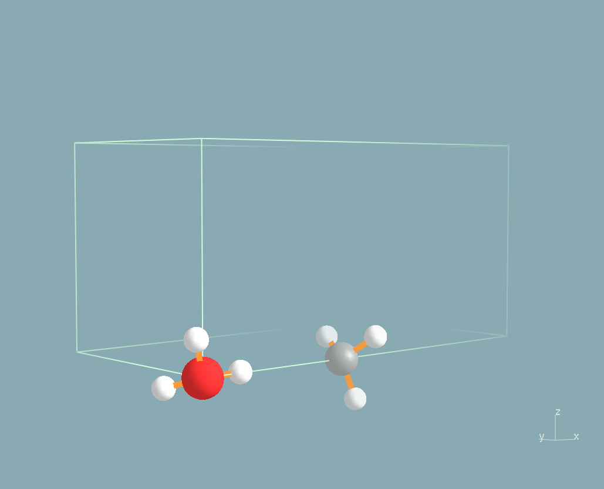
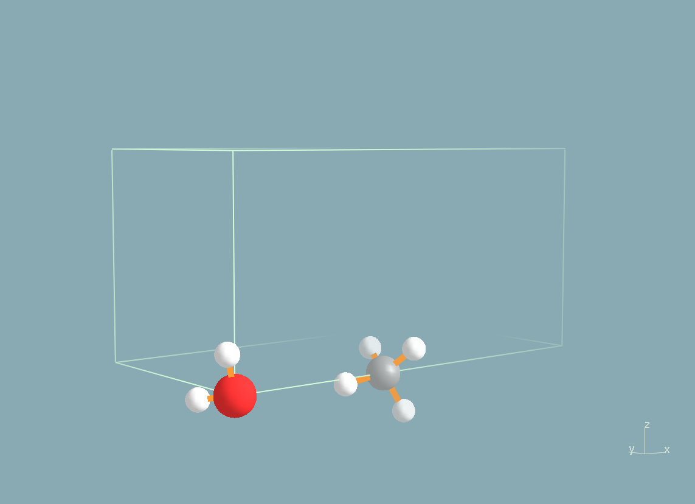
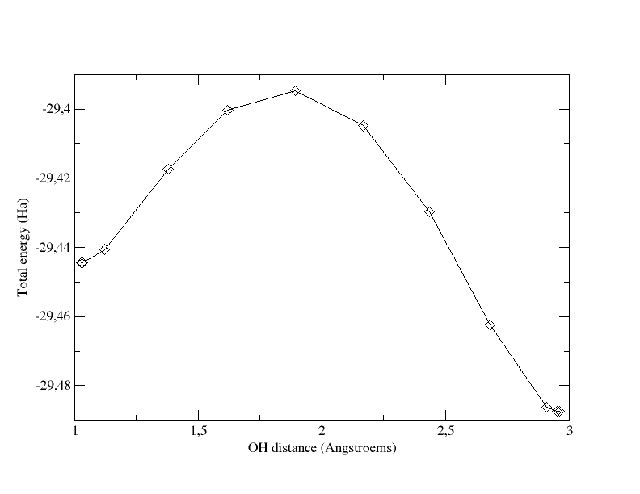
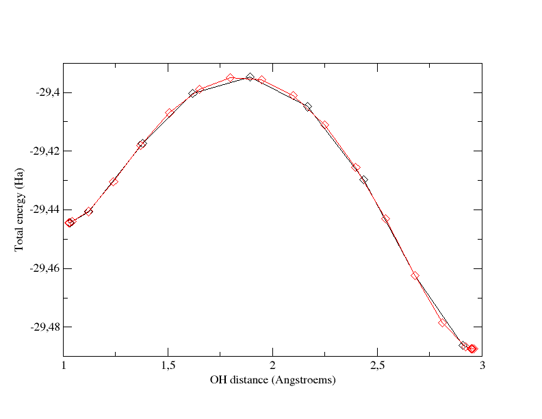
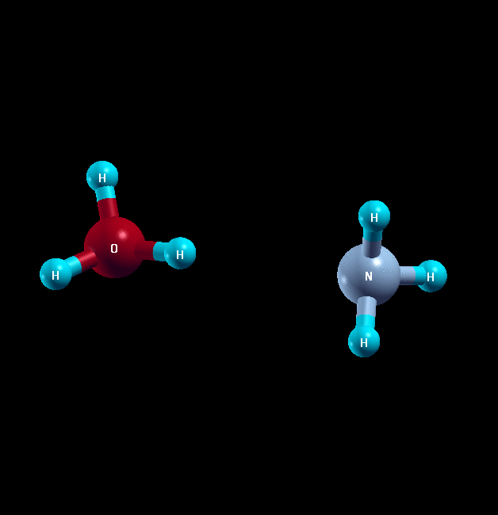
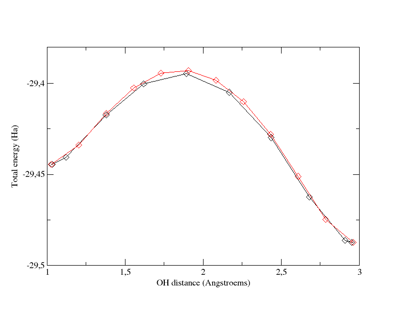

# Parallelism on images, the string method  

## String method for the computation of minimum energy paths, in parallel.  

This lesson aims at showing how to perform a calculation of a minimum energy
path (MEP) using the string method.

You will learn how to run the string method on a parallel architecture and
what are the main input variables that govern convergence and numerical
efficiency of the parallelism on "images".  

This lesson should take about 1.5 hour and requires to have at least a 200 CPU
cores parallel computer.

You are supposed to know already some basics of parallelism in ABINIT, explained in the tutorial 
[A first introduction to ABINIT in parallel](basepar), and  [ground state with plane waves](paral_gspw).

## 1 Summary of the String Method
  
The string method [1] is an algorithm that allows the computation of a Minimum
Energy Path (MEP) between an initial (i) and a final (f) configuration. It is
inspired from the Nudge Elastic Band (NEB) method. An elastic chain of
configurations joining (i) to (f) is progressively driven to the MEP using an
iterative procedure in which each iteration consists of two steps:  
(1) evolution step: the images are moved following the atomic forces,  
(2) reparametrization step: the images are equally redistributed along the string.  
The algorithm presently implemented in ABINIT is the so-called "simplified
string method" [2]. It has been designed for the sampling of smooth energy landscapes.  
[1] "String method for the study of rare events", W. E, W. Ren, E. Vanden-
Eijnden, Physical Review B 66, 052301 (2002).  
[2] "Simplified string method for computing the minimum energy path in
barrier-crossing events", W. E, W. Ren, E. Vanden-Eijnden, J. Chem. Phys. 126, 164103 (2007).  

Before continuing you might work in a different subdirectory as for the other
lessons. Why not "work_paral_string" ? In what follows, the names of files are
mentionned as if you were in this subdirectory.  
All the input files can be found in the ~abinit/tests/tutoparal/Input directory.  
You can compare your results with reference output files located in
~abinit/tests/tutoparal/Refs.  
  
In the following, when "run ABINIT over nn CPU cores" appears, you have to use
a specific command line according to the operating system and architecture of
the computer you are using. This can be for instance: mpirun -n nn abinit <
abinit.files or the use of a specific submission file.  

## 2 Computation of the initial and final configurations

We propose to compute the energy barrier for transferring a proton from an
hydronium ion (H3O+) onto a NH3 molecule:  

    H3O+ \+ NH3 -> H2O + NH4+

Starting from an hydronium ion and an ammoniac molecule, we obtain as final
state a water molecule and an ammonium ion NH4+. In such a process, the MEP
and the barrier are dependent on the distance between the hydronium ion and
the NH3 molecule. Thus we choose to fix the O atom of H3O+ and the N atom of
NH3 at a given distance from each other (4.0 Ä). The calculation is performed
using a LDA exchange-correlation functional.  
  
You can visualize the initial and final states of the reaction below (H atoms
are in white, the O atom is in red and the N atom in grey).  
  

  
  
Before using the string method, it is necessary to optimize the initial and
final points. The input files tstring_01.in and tstring_02.in contain
respectively two geometries close to the initial and final states of the
system. You have first to optimize properly these initial and final
configurations, using for instance the Broyden algorithm implemented in ABINIT.  
  
Open the tstring_01.in file and look at it carefully. The unit cell is defined
at the end. Note that the keywords [[natfix]] and [[iatfix]] are used to keep
fixed the positions of the O and N atoms. The cell is tetragonal and its size
is larger along x so that the periodic images of the system are separated by
4.0 Ä of vacuum in the three directions. The keyword [[charge]] is used to
remove an electron of the system and thus obtain a protonated molecule
(neutrality is recovered by adding a uniform compensating charge background).  
  
The exchange-correlation functional uses the external library libxc. You have
to compile ABINIT using the libxc plugin (if not, simply replace
[[ixc]]=-001009 by [[ixc]] 7). This input file has to be run in parallel using
20 CPU cores. You might use the tstring.files file. Edit it and adapt it with
the appropriate file names.  
  
Then run the calculation in parallel over 20 CPU cores, first for the initial
configuration (tstring_01.in), and then for the final one (tstring_02.in). You
should obtain the following positions:  
  
1) for the initial configuration  

           xangst      0.0000000000E+00  0.0000000000E+00  0.0000000000E+00  
                      -3.7593832509E-01 -2.8581911534E-01  8.7109635973E-01  
                      -3.8439081179E-01  8.6764073738E-01 -2.8530130333E-01  
                       4.0000000000E+00  0.0000000000E+00  0.0000000000E+00  
                       4.3461703447E+00 -9.9808458269E-02 -9.5466143436E-01  
                       4.3190273240E+00 -7.8675247603E-01  5.6699786920E-01  
                       4.3411410402E+00  8.7383785043E-01  4.0224838603E-01  
                       1.0280313162E+00  2.2598784215E-02  1.5561763093E-02  
  
2) for the final configuration  

           xangst      0.0000000000E+00  0.0000000000E+00  0.0000000000E+00  
                      -3.0400286349E-01 -1.9039526061E-01  9.0873550186E-01  
                      -3.2251946581E-01  9.0284480687E-01 -1.8824324581E-01  
                       4.0000000000E+00  0.0000000000E+00  0.0000000000E+00  
                       4.4876385468E+00 -1.4925704575E-01 -8.9716581956E-01  
                       4.2142401901E+00 -7.8694929117E-01  6.3097154506E-01  
                       4.3498225718E+00  8.7106686509E-01  4.2709343135E-01  
                       2.9570301511E+00  5.5992672027E-02 -1.3560839453E-01  

## 3 Related keywords
  
Once you have properly optimized the initial and final states of the process,
you can turn to the computation of the MEP. Let us first have a look at the
related keywords.  
  
1) [[imgmov]]: selects an algorithm using replicas of the unit cell. 
    For the string method, choose 2.  

2) [[nimage]]: gives the number of replicas of the unit cell including the
    initial and final ones.  

3) [[dynimage]]([[nimage]]): arrays of flags specifying if the image evolves
    or not (0: does not evolve; 1: evolves).  

4) [[ntimimage]]: gives the maximum number of iterations (for the relaxation
    of the string).  

5) [[tolimg]]: convergence criterion (in Hartree) on the total energy
    (averaged over the [[nimage]] images).  

6) [[fxcartfactor]]: "time step" (in Bohr^2/Hartree) for the evolution step of
    the string method. For the time being (ABINITv6.10), only steepest-descent
    algorithm is implemented.  

7) [[npimage]]: gives the number of processors among which the work load over
    the image level is shared. Only dynamical images are considered (images for
    which [[dynimage]] is 1). This input variable can be automatically set by
    ABINIT if the number of processors is large enough.  

8) [[prtvolimg]]: governs the printing volume in the output file (0: full
    output; 1: intermediate; 2: minimum output).

## 4 Computation of the MEP without parallelism over images
  
You can now start with the string method.

First, for test purpose, we will not use the parallelism over images and will
thus only perform one step of string method.

Open the tstring_03.in file and look at it. The initial and final
configurations are specified at the end through the keywords [[xangst] and
[[nimage|xangst_lastimg]]. By default, ABINIT generates the intermediate
images by a linear interpolation between these two configurations. In this
first calculation, we will sample the MEP with 12 points (2 are fixed and
correspond to the initial and final states, 10 are evolving). [[nimage]] is
thus set to 12. The keyword [[npimage]] is set to 1 (no parallelism over
images) and [[ntimimage]] is set to 1 (only one time step).

You might use the tstring.files file. Edit it and adapt it with the
appropriate file names. Since the parallelism over the images is not used,
this calculation has to be run over 20 CPU cores.

## 5 Computation of the MEP using parallelism over images
  
Now you can perform the complete computation of the MEP using the parallelism
over the images.  
  
Open the tstring_04.in file. The keyword [[npimage]] has been set to 10, and
[[ntimimage]] has been increased to 50.  
  
This calculation has thus to be run over 200 CPU cores. Note that the output
file is very big, so that no reference file is provided in the ABINIT package.  
  
The convergence of the string method algorithm is controlled by [[tolimg]],
which has been set to 0.0001 Ha. In order to obtain a more lisible output
file, you can decrease the printing volume and set [[prtvolimg]] to 2. Here
again, you might use the tstring.files. Edit it and adapt it with the
appropriate file names. Then run ABINIT over 200 CPU cores.  
  
When the calculation is completed, ABINIT provides you with 12 configurations
that sample the Minimum Energy Path between the initial (i) and final (f)
states. Plotting the total energy of these configurations with respect to a
reaction coordinate that join (i) to (f) gives you the energy barrier that
separates (i) from (f). In our case, a natural reaction coordinate can be the
distance between the hopping proton and the O atom of H2O (dOH), or
equivalently the distance between the proton and the N atom (dHN). The graph
below shows the total energy as a function of the OH distance along the MEP.
It indicates that the barrier for crossing from H2O to NH3 is ~ 1.36 eV. The
6th image gives an approximate geometry of the transition state. Note that in
the initial state, the OH distance is significantly stretched, due to the
presence of the NH3 molecule.  
  
Note that the total energy of each of the 12 replicas of the simulation cell
can be found at the end of the output file in the section:  
 -outvars: echo values of variables after computation  \--------  
  
The total energies are printed out as: etotal_1img, etotal_2img, ....,
etotal_12img.  
Also, you can can have a look at the atomic positions in each image: in
cartesian coordinates (xcart_1img, xcart_2img, ...) or in reduced coordinates
(xred_1img, xred_2img, ...). Similarly, the forces are printed out:
fcart_1img, fcart_2img, ..., fcart_12img.  

  

Total energy as a function of OH distance for the path computed with 12 images
and tolimg=0.0001 (which is very close to the x coordinate of the proton:
first coordinate of xangst for the 8th atom in the output file).  
  
The keyword [[npimage]] can be automatically set by ABINIT. It takes the
requested total number of CPU cores divided by the number of dynamical images.
The remaining cores are, if possible, distributed over k, band and FFT.  
  
Let us test this functionnality. Edit again the tstring_04.in file and comment
the [[npimage]] line. Then run the calculation again over a number of cores of
your choice (less than 200). If the code stops with an error message
indicating that the number of kpt, band and FFT processors is not correct,
adapt the value of [[npband]] and [[npfft]].  
  
Open the output file and look at the [[npimage]] value ...

## 6 Converging the MEP
  
Like all physical quantities, the MEP has to be converged with respect to some
numerical parameters. The two most important are the number of points along
the path ([[nimage]]) and the convergence criterion ([[tolimg]]).  
  
1) [[nimage]]  
Increase the number of images to 22 (2 fixed + 20 evolving) and recompute the
MEP. The graph below superimposes the previous MEP (black curve, calculated
with 12 images) and the new one obtained by using 22 images (red curve). You
can see that the global profile is almost not modified as well as the energy
barrier.  

  

Total energy as a function of OH distance for the path computed with 12 images
and tolimg=0.0001 (black curve) and the one computed with 22 images and
tolimg=0.0001 (red curve).  
  
The following animation (animated gif file) is made by putting together the 22
images obtained at the end of this calculation, from (i) to (f) and then from
(f) to (i). It allows to visualize the MEP.  
  

  

Click on the above image to visualize the animation (that should open in another window).  
  
2) [[tolimg]]  
Come back to [[nimage]]=12. First you can increase [[tolimg]] to 0.001 and
recompute the MEP. This will be much faster than in the previous case.  
  
Then you should decrease [[tolimg]] to 0.00001 and recompute the MEP. To gain
CPU time, you can start your calculation by using the 12 images obtained at
the end of the calculation that used [[tolimg]]=0.0001. In your input file,
these starting images will be specified by the keywords [[xangst]],
[[nimage|xangst_2img]], [[nimage|xangst_3img]] ... [[nimage|xangst_12img]].
You can copy them directly from the output file obtained at the previous
section. The graph below superimposes the path obtained with 12 images and
[[tolimg]]=0.001 (red curve) and the one with 12 images and [[tolimg]]=0.0001
(black curve).  

  

Total energy as a function of OH distance for the path computed with 12 images
and tolimg=0.0001 (black curve) and the one computed with 12 images and tolimg=0.001 (red curve).  
