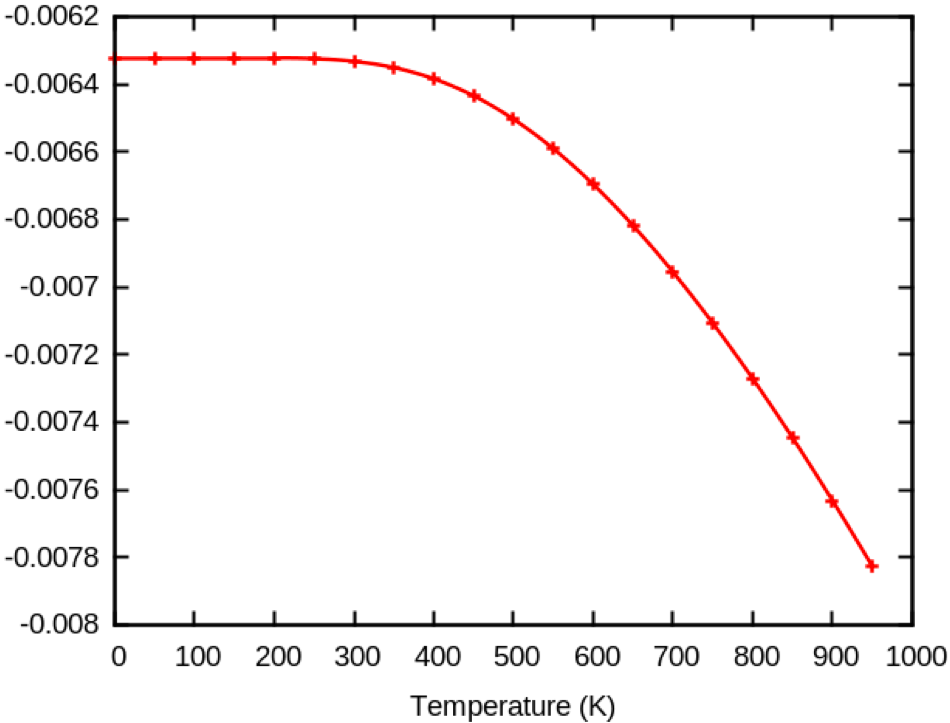
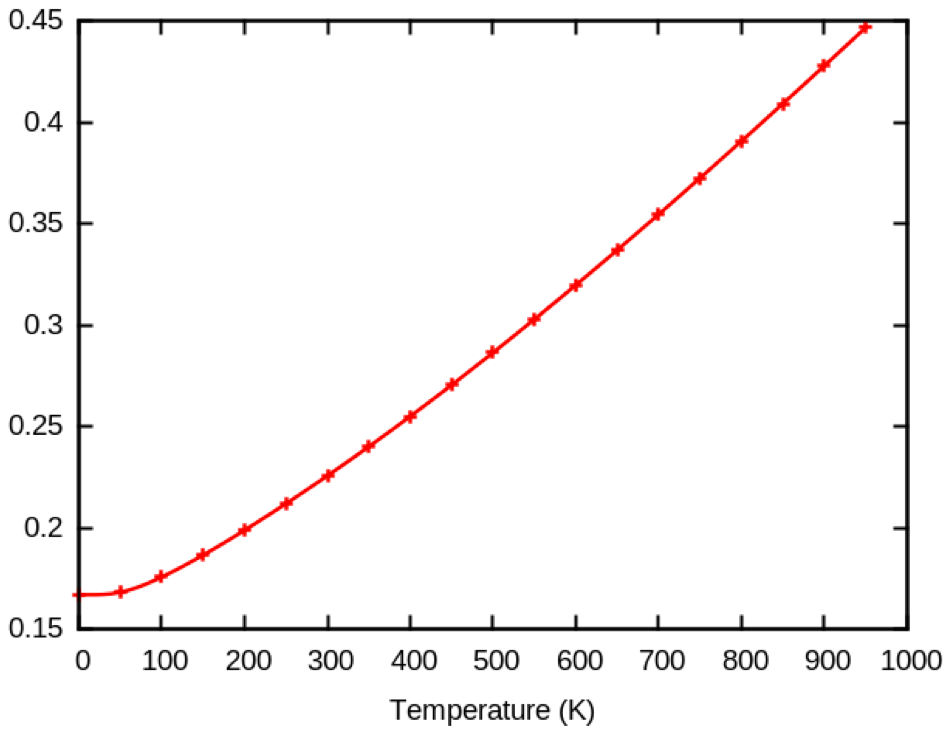
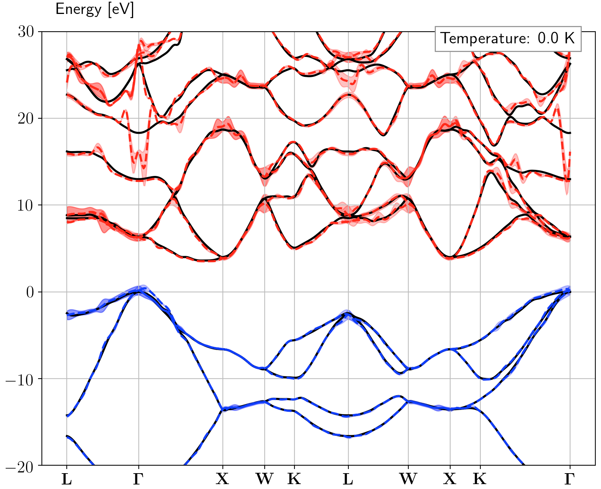

# Lesson TDepES  

## Temperature-DEPendence of the Electronic Structure.  

This lesson aims at showing how to get the following physical properties, for periodic solids:

  * The zero-point-motion renormalization (ZPR) of eigenenergies  

  * The temperature-dependence of eigenenergies  

  * The lifetime/broadening of eigenenergies  

For the theory related to the temperature-dependent calculations, you can read
the following papers: [[cite:Ponce2015]], [[cite:Ponce2014]] and [[cite:Ponce2014a]].

There are two ways to compute the temperature dependence with Abinit:

  * **Using Anaddb**: historically the first implementation. This option does not require Netcdf.

  * **Using post-processing python scripts**: this is the recommended approach as it provides more options 
    and is more efficient (less disk space, less memory demanding). This option 
    **requires Netcdf** (both in Abinit and python). 

!!! important

    In order to run the python script you need:

      * python 2.7.6 or higher, python3 is not supported
      * numpy 1.7.1 or higher 
      * netCDF4 and netCDF4 for python 
      * scipy 0.12.0 or higher 

    Abinit must be configured with: `configure --with-config-file=myconf.ac`
    where the configuration file must contain at least:

        with_trio_flavor="netcdf+other-options"

        # To link against an external libs, use
        #with_netcdf_incs="-I${HOME}/local/include"

        # if (netcdf4 + hdf5):
        #with_netcdf_libs="-L/usr/local/lib -lnetcdff -lnetcdf -L${HOME}/local/lib -lhdf5_hl -lhdf5"  
        # else if netcdf3:
        #with_netcdf_libs="-L${HOME}/local/lib/ -lnetcdff -lnetcdf"  

    A list of configuration files for clusters is available in the 
    [abiconfig repository](https://github.com/abinit/abiconfig)

    If you have a prebuilt abinit executable, use:
        
        abinit -b 

    to get the list of libraries/options activated in the build.
    You should see netcdf in the `TRIO flavor` section:

         === Connectors / Fallbacks ===
          Connectors on : yes
          Fallbacks on  : yes
          DFT flavor    : libxc-fallback
          FFT flavor    : none
          LINALG flavor : netlib-fallback
          MATH flavor   : none
          TIMER flavor  : abinit
          TRIO flavor   : netcdf

This lesson should take about 1 hour to be done.

## 1 Calculation of the ZPR of eigenenergies at q=Γ
  
The reference input files for this lesson are located in
~abinit/tests/tutorespfn/Input and the corresponding reference output files
are in ~abinit/tests/tutorespfn/Refs.
The prefix for files is **tdepes**.

First, examine the [[tests/tutorespfn/Input/tdepes_1.in]] input file
(note the use of the [[ieig2rf]] = 5 input variable required by the python script).


We will use [[tests/tutorespfn/Input/tdepes_1.files]] to execute abinit
(it will be the same file for the other Abinit calculations of this tutorial,
except that the last digit of the names have to be changed in this file ...



In order to run abinit, we suggest that you create a working directory as subdirectory of ~abinit/tests/tutorespfn/Input, then
copy/modify the relevant files. In detail :

    mkdir Work 
    cd Work
    cp ../*in ../*files .

Then edit the [[tests/tutorespfn/Input/tdepes_1.files]] to give the proper location of the pseudopotential file.
Finally, issue    

    abinit < tdepes_1.files > tdepes_1.out

(where `abinit`might have to be replaced by the proper location of the abinit executable).

### If Abinit is compiled with Netcdf...

If you have compiled the code with Netcdf, the calculation will produce _EIG.nc,
_DDB, EIGR2D.nc and EIGI2D.nc that contain respectively the eigenvalues (GS or
perturbed), the second-order derivative of the total energy with respect to
two atomic displacements, the electron-phonon matrix elements used to compute
the renormalization of the eigenenergies and the electron-phonon matrix
elements used to compute the lifetime of the electronic states. 

You can now copy the post-processing python scripts from
~abinit/scripts/post_processing/temperature-dependence/rf_final.py.
Make sure you are in the directory containing the output files produced by the code and then:

    cp ~abinit/scripts/post_processing/temperature-dependence/temperature_final.py .
    cp ~abinit/scripts/post_processing/temperature-dependence/rf_final.py .


<!--
as well as the python file
containing the required classes from ~abinit/scripts/post_processing/mrgeignc.py
into the directory where you did the calculations. 
-->

You can then simply run the python script with the following command:
    
    temperature_para.py

and enter the information asked by the script

A typical example of input file for the script is:

```
1                          # Number of cpus 
2                          # Static ZPR computed in the Allen-Heine-Cardona theory
temperature                # Prefix for output files
0.1                        # Value of the smearing parameter for AHC (in eV)
0.1                        # Gaussian broadening for the Eliashberg function and PDOS (in eV)
0 0.5                      # Energy range for the PDOS and Eliashberg calculations (in eV)
0 1000 50                  # min, max temperature and temperature step
1                          # Number of Q-points we have (here we only computed $\Gamma$)
tdepes_1o_DS3_DDB          # Name of the response-funtion (RF) DDB file
tdepes_1o_DS2_EIG.nc       # Eigenvalues at $\mathbf{k+q}$
tdepes_1o_DS3_EIGR2D.nc    # Second-order electron-phonon matrix element 
tdepes_1o_DS3_GKK.nc       # Name of the 0 GKK file
tdepes_1o_DS1_EIG.nc       # Name of the unperturbed EIG.nc file with Eigenvalues at $k$
```

Alternatively, copy this example, **remove** all the comments after `#`  and then run

    ./temperature_final_example < temperature_final_example.in



!!! warning

    Remember to use py2.7 and install the libraries required by the script before running.

    For pip, use:

        pip install netcdf4

    or:

        conda install netcdf4

    if you are using [conda](https://conda.io/miniconda.html)


You should see on the screen:

```shell
Start on 15/3/2018 at 13h29

    ____  ____       _                                      _
   |  _ \|  _ \     | |_ ___ _ __ ___  _ __   ___ _ __ __ _| |_ _   _ _ __ ___
   | |_) | |_) |____| __/ _ \ '_ ` _ \| '_ \ / _ \ '__/ _` | __| | | | '__/ _ \
   |  __/|  __/_____| ||  __/ | | | | | |_) |  __/ | | (_| | |_| |_| | | |  __/
   |_|   |_|         \__\___|_| |_| |_| .__/ \___|_|  \__,_|\__|\__,_|_|  \___|
                                      |_|                              Version 1.3

This script compute the static/dynamic zero-point motion
  and the temperature dependance of eigenenergies due to electron-phonon interaction.
  The electronic lifetime can also be computed.

  WARNING: The first Q-point MUST be the Gamma point.

Enter the number of cpu on which you want to multi-thread
Define the type of calculation you want to perform. Type:
                        1 if you want to run a non-adiabatic AHC calculation
                         2 if you want to run a static AHC calculation
                         3 if you want to run a static AHC calculation without control on active space (not recommended !)
   Note that for 1 & 2 you need _EIGR2D.nc and _GKK.nc files obtained through ABINIT option "ieig2rf 5"
Enter name of the output file
Enter value of the smearing parameter for AHC (in eV)
Enter value of the Gaussian broadening for the Eliashberg function and PDOS (in eV)
Enter the energy range for the PDOS and Eliashberg calculations (in eV): [e.g. 0 0.5]
Introduce the min temperature, the max temperature and the temperature steps. e.g. 0 200 50 for (0,50,100,150)
Enter the number of Q-points you have
Enter the name of the 0 DDB file
Enter the name of the 0 eigq file
Enter the name of the 0 EIGR2D file
Enter the name of the 0 GKK file
Enter the name of the unperturbed EIG.nc file at Gamma
Q-point:  0  with wtq = 1.0  and reduced coord. [ 0.  0.  0.]
Now compute active space ...
Now compute generalized g2F Eliashberg electron-phonon spectral function ...
End on 15/3/2018 at 13 h 29
Runtime: 0 seconds (or 0.0 minutes)
```

The python code has generated the following files:

**temperature.txt** 
: This text file contains the zero-point motion (ZPM) correction at each k-point for each band. 
  It also contain the evolution of each band with temperature at k=Γ. 
  At the end of the file, the Fan/DDW contribution is also reported. 

**temperature_EP.nc** 
: This netcdf file contains a number for each k-point, 
  for each band and each temperature. The real part of this number is the ZPM correction 
  and the imaginary part is the lifetime. 

<!--
**temperature_BRD.txt** 
: This text file contains the lifetime of the electronic states 
  at each k-point for each band. It also contains the evolution of each band with temperature at k=Γ. 
-->

We can for example visualize the temperature dependence at k=Γ of the HOMO bands 
(`Band: 3` dataset in the **temperature.txt** file, that you can examine) 
with the contribution of only the q=Γ .

<!--


Here you can see that the HOMO correction goes down with temperature. This is
due to the use of underconvergence parameters. If you increase [[ecut]] from
5 to 10, you get the following plot.  
-->


The HOMO eigenenergies correction goes up with temperature... You can
also plot the LUMO corrections and see that they go down. The
ZPR correction as well as their temperature dependence usually closes the gap
of semiconductors. 

As usual, checking whether the input parameters give converged values is of course important.
The run used [[ecut]]=10. With [[ecut]]=5, the HOMO correction goes down with temperature.

### If Abinit is **not** compiled with Netcdf ...

In this case, we should first use mrgddb to merge the _DDB and _EIGR2D/_EIGI2D
but since we only have one q-point we do not have to perform this step. 
The static temperature dependence and the G2F can be computed thanks to anaddb
with the files file [[tests/tutorespfn/Input/tdepes_2.files]] and the input
file [[tests/tutorespfn/Input/tdepes_2.in]].



The run will generate 3 files:

**tdepes_2.out_ep_G2F**
:  This g2F spectral function represents the contribution of the phononic modes of energy E 
   to the change of electronic eigenenergies according to the equation  


**tdepes_2.out_ep_PDS**
:  This file contains the phonon density of states 

**tdepes_2.out_ep_TBS**
:  This file contains the eigenenergy corrections as well 
   as the temperature dependence one. 
   You can check that the results are the same as with the python script approach here above. 

## 2 Converging the calculation with the q-point grid

From now on we will only describe the approach with Abinit **compiled with Netcdf support**. 
The approach with Anaddb is similar to what we described in the previous sections.
Note, however, that Anaddb only supports integration with homogenous q-point grids. 
while the netcdf version can perform the integration either with random q-points or
homogenous Monkhorst-Pack meshes. 

For the random integration method you
should create a script that generates random q-point, perform the Abinit
calculations at these points and finally analyze them 
The script will detect that you used random
integration thanks to the weight of the q-point stored in the _EIGR2D.nc file
and perform the integration accordingly.
The random integration converges slowly but in a consistent manner. 

Since this methods is a little bit less user-friendly, we will focus on the homogenous integration. 
The first thing we need to do is to determine the number of q-point in the IBZ for a given
q-point grid. We choose here a 4x4x4 q-point grid. 

Use the input file [[tests/tutorespfn/Input/tdepes_3.in]]. 



Launch this job, and kill it after a few seconds. 
Then look into the log file to find the following line after the list of q-points:
    
```
symkpt : the number of k-points, thanks to the symmetries,
is reduced to     8
```

In general, in order to get the number of q-points, launch a "fake" run with a
k-point grid equivalent to the q-point grid you want to use in your
calculation. Now that we know that the 4x4x4 q-point grid reduces to 8 points in the IBZ,
we can make the following substitution into the input file
    
    ndtset 3 udtset 1 3 ==>  ndtset 24 udtset 8 3

and launch the calculation. 
When the run is finished, copy the file [[tests/tutorespfn/Input/tdepes_3.files]] in the 
working directory and launch the python script with:
    
    ./temperature_final.py < tdepes_3.files



Plotting the same HOMO band at k=Γ for a 4x4x4 q-point grid gives a very different result
than previously (note that this graph has been obtained with [[ecut]] = 10).  



As a matter of fact, diamond requires an extremely dense q-point grid (40x40x40) to be converged. 
On the bright side, each q-point calculation is independent and thus the parallel scaling is ideal...

## 3 Calculation of the eigenenergies correction along high-symmetry lines
  
The calculation of the electronic eigenvalue correction due to electron-phonon
coupling along high-symmetry lines requires the use of 6 datasets per q-point.
Different datasets are required to compute the following quantites:

$\Psi^{(0)}_{kHom}$
:       The ground-state wavefunctions on the Homogeneous k-point sampling. 

$\Psi^{(0)}_{kBS}$
:       The ground-state wavefunctions computed along the bandstructure k-point sampling. 

$\Psi^{(0)}_{kHom+q}$
:       The ground-state wavefunctions on the shifted Homogeneous k+q-point sampling. 

$n^{(1)}$
:       The perturbed density integrated over the homogeneous k+q grid. 

$\Psi^{(0)}_{kBS+q}$
:       The ground-state wavefunctions obtained from reading the perturbed density of the previous dataset. 

Reading the previous quantity we obtain the el-ph matrix elements along the BS with all physical 
quantities integrated over a homogeneous grid. 

Run the calculation using the [[tests/tutorespfn/Input/tdepes_4.in]] input file



then use [[tests/tutorespfn/Input/tdepes_4.files]] for the python script. 



with the usual syntax:

    ./temperature_final.py < tdepes_4.files 

Of course, the high symmetry points computed in section 2 have the same value here. 
It is a good idea to check it by running the script with the file [[tests/tutorespfn/Input/tdepes_3bis.files]].



You can now copy the plotting script (Plot-EP-BS) python file from
~abinit/scripts/post_processing/plot_bs.py into the directory where you did all the calculations.  
Now row the script:

    ./plot_bs.py < bs.input

with the following input data:
    
```
tdepes4_EP.nc
L \Gamma X W K L W X K \Gamma
-20 30
0
```

This should give you the following bandstructure  



where the solid black lines are the traditional electronic bandstructure, the
dashed lines are the electronic eigenenergies with electron-phonon
renormalization at a defined temperature (here 0K). Finally the area around
the dashed line is the lifetime of the electronic eigenstates.

Notice all the spiky jumps in the renormalization. This
is because we did a completely under-converged calculation.

It is possible to converge the calculations using [[ecut]]=30 Ha, a [[ngkpt]]
grid of 6x6x6 and an increasing [[ngqpt]] grid to get converged results:
    
    | Convergence study ZPR and inverse lifetime(1/τ) [meV] at 0K               |
    | q-grid   | Nb qpt |       Γ25'       |        Γ15       |      Min Γ-X     | 
    |          | in IBZ |  ZPR   |  1/τ   |   ZPR   |  1/τ   |   ZPR   |  1/τ   |
    | 4x4x4    |  8     | 0.1175 | 0.0701 | -0.3178 | 0.1916 | -0.1570 | 0.0250 |
    | 10x10x10 |  47    | 0.1390 | 0.0580 | -0.3288 | 0.1847 | -0.1605 | 0.0308 |
    | 20x20x20 |  256   | 0.1446 | 0.0574 | -0.2691 | 0.1823 | -0.1592 | 0.0298 |
    | 26x26x26 |  511   | 0.1448 | 0.0573 | -0.2736 | 0.1823 | -0.1592 | 0.0297 |
    | 34x34x34 |  1059  | 0.1446 | 0.0573 | -0.2699 | 0.1821 | -0.1591 | 0.0297 | 
    | 43x43x43 |  2024  | 0.1447 | 0.0572 | -0.2650 | 0.1821 | -0.1592 | 0.0297 |

As you can see the limiting factor for the convergence study is the
convergence of the LUMO band at Γ. This band is not the lowest in energy (the
lowest is on the line between Γ and X) and therefore this band is rather
unstable. This can also be seen by the fact that it has a large electronic
broadening, meaning that this state will decay quickly into another state.

Using the relatively dense q-grid of 43x43x43 we can obtain the following
converged bandstructure, at a high temperature (1900K):  


Here we show the renormalization at a very high temperature of 1900K in order
to highlight more the broadening and renormalization that occurs. If you want
accurate values of the ZPR at 0K you can look at the table above.

### Possible issue while converging your calculations

If you use an extremely fine q-point grid, the acoustic phonon frequencies for
q-points close to Γ will be wrongly determined by Abinit. Indeed in order to
have correct phonon frequencies, you have to impose the acousting sum rule
with anaddb and [[asr@anaddb]]. 
Since this feature is not available in the python script, we have to reject the
contribution of the acoustic phonon close to Γ if their phonon frequency is
lower than 1E-6 Ha. Otherwise you get unphysically large contribution. 

You can tune this parameter by editing the variable "tol6 = 1E-6" in the beginning of the script.
For example, for the last 43x43x43 calculation, it was set to 1E-4.
